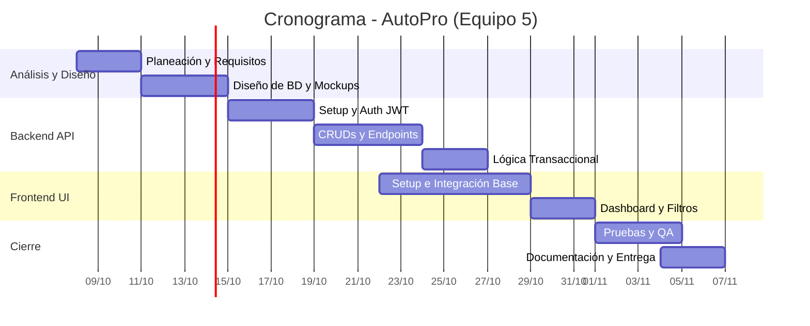

# Planeación y organización del proyecto final de software

## 1. Presentación y alcance del proyecto

**Nombre del proyecto:** AutoPro - Sistema de Gestión Automotriz (Taller Mecánico)
**Equipo:** 5

**Integrantes:**
* Martinez Piñera Yael Isai
* Rosales Fernandez Juan Emmanuel
* Montalvo Garcia Juan Pablo
* Santos Guerrero Luis Fernando
* Valadez Zuñiga Angel Uriel

**Problema que atenderán:**
Los talleres mecánicos suelen llevar el registro de clientes, vehículos, diagnósticos e inventario de refacciones de forma manual o en hojas de cálculo aisladas. Esto genera pérdida de información, errores en la facturación y presupuestos, falta de seguimiento en el historial del vehículo y pérdida de tiempo al consultar existencias de refacciones, afectando directamente la calidad del servicio al cliente.

**Usuarios principales:**
1. **Administrador/Gerente:** Control total del sistema, gestión de empleados, inventario, reportes y métricas.
2. **Mecánico/Recepción:** Registro de clientes, recepción de vehículos, creación de órdenes de servicio y actualización del estado de las reparaciones.

**Objetivo general:**
Desarrollar e implementar un sistema web integral (AutoPro) que centralice la información del taller mecánico, optimizando el registro de órdenes de servicio, el control de inventario de refacciones y el seguimiento del estado de los vehículos, para mejorar la eficiencia operativa y la atención al cliente.

**Funciones de la versión final:**
* Autenticación y autorización basada en roles (JWT).
* Gestión de Usuarios (Empleados).
* Gestión de Clientes y Vehículos (Relacionados).
* Gestión de Inventario de Refacciones.
* Operación transaccional: Creación de Órdenes de Servicio (asociando cliente, vehículo y descontando refacciones del inventario).
* Dashboard interactivo con métricas y gráficas dinámicas.
* Generación de reportes (ej. Órdenes por rango de fechas).
* Buscador, filtros y paginación en los listados principales.

**Exclusiones y restricciones:**
* **Exclusiones:** El sistema no procesará pagos con tarjeta (pasarelas de pago) ni emitirá facturación electrónica (CFDI ante el SAT); los pagos se registrarán de manera representativa de forma interna. No incluirá módulo de nóminas.
* **Restricciones:** El sistema requiere conexión a internet para su uso (modelo Cliente-Servidor). Estará optimizado para resoluciones de escritorio y tablets, con un diseño responsivo básico para móviles.

---

## 2. Identificación de requisitos y entregables

| Requisito Obligatorio | Módulo | Actividad Necesaria | Responsable | Evidencia |
| :--- | :--- | :--- | :--- | :--- |
| Arquitectura cliente-servidor | Base / Configuración | Setup del entorno backend (Node) y frontend (React) | Martinez Piñera Yael | Repositorio GitHub con carpetas backend/ y frontend/ |
| BD con al menos 6 tablas en 3FN | Base de Datos | Diseño del modelo relacional (Usuarios, Roles, Clientes, Vehículos, Servicios, Refacciones, Detalle_Servicio) | Rosales Fernandez Juan | Script SQL y Diagrama Entidad-Relación |
| 3 módulos con CRUD y 12 endpoints | Backend / API | Desarrollo de API REST con Express para Clientes, Vehículos e Inventario | Montalvo Garcia Juan P. | Documentación de la API (Markdown o Postman/Swagger) |
| Autenticación, usuarios y 2 roles | Seguridad | Implementación de JWT, encriptación con bcrypt y middleware de roles | Santos Guerrero Luis | Código fuente y demostración de denegación de acceso |
| Dashboard, 5 reglas de negocio y 1 transacción | Frontend / Backend | Programar vista Dashboard y lógica transaccional para "Orden de Servicio" | Valadez Zuñiga Angel | Procedimiento transaccional en API y vista principal |
| Buscador, filtros, ordenamiento y paginación | Interfaz de Usuario | Implementar datatables en listas de Clientes e Inventario | Martinez Piñera Yael | Vistas interactivas funcionales en el sistema |
| Historial, 2 reportes y 2 gráficas (1 con fechas) | Reportes | Integración de librería Recharts y generación de reportes desde la API | Rosales Fernandez Juan | Pantalla de reportes y descarga funcional |
| Validaciones, errores, seguridad, diseño responsivo | UI / Seguridad | Middleware de manejo de errores, alertas UI y uso de TailwindCSS | Santos Guerrero Luis | Código de validaciones y pruebas de interfaz |
| Git, README, doc. API, instalación | Documentación | Documentar endpoints y redactar pasos para levantar el entorno local | Montalvo Garcia Juan P. | Archivo README.md completo en el repositorio |
| Documentación final en PDF | Entrega | Integración del documento final según los lineamientos | Valadez Zuñiga Angel | Documento PDF finalizado |

---

## 3. Desglose de actividades y responsabilidades

| ID | Descripción de la Actividad | Responsable Principal | Apoyo | Duración | Dependencias | Entregable / Criterio de término |
| :--- | :--- | :--- | :--- | :--- | :--- | :--- |
| **A1** | Levantamiento de requerimientos y Planeación | Todos | - | 3 días | Ninguna | Documento de planeación aprobado. |
| **A2** | Diseño de Base de Datos y Diccionario | Rosales Juan | Martinez Yael | 4 días | A1 | Diagrama ER y Script SQL listos. |
| **A3** | Diseño de Interfaz (Mockups UI/UX) | Santos Luis | Montalvo Juan | 4 días | A1 | Vistas diseñadas. |
| **A4** | Setup del Backend (Node/Express/Postgres) | Montalvo Juan | Valadez Angel | 2 días | A2 | Servidor local corriendo y conectado a DB. |
| **A5** | Desarrollo de Auth y Roles (JWT) | Santos Luis | Rosales Juan | 3 días | A4 | Endpoints de login y registro protegidos. |
| **A6** | Desarrollo Endpoints CRUD (Clientes, Vehículos, Inv) | Montalvo Juan | Martinez Yael | 5 días | A4, A5 | API probada en Postman (12+ endpoints). |
| **A7** | Desarrollo Operación Transaccional (Órdenes) | Valadez Angel | Rosales Juan | 4 días | A6 | Endpoint de orden de servicio funcionando. |
| **A8** | Setup del Frontend (React, Vite, Tailwind) | Martinez Yael | Santos Luis | 2 días | A3 | Proyecto React base corriendo. |
| **A9** | Desarrollo Vistas CRUD e Integración API | Martinez Yael | Montalvo Juan | 7 días | A6, A8 | Interfaces funcionales consumiendo la API. |
| **A10** | Implementación de Dashboard y Gráficas (Recharts) | Valadez Angel | Santos Luis | 4 días | A7, A9 | Dashboard renderizando datos reales. |
| **A11** | Validaciones, Paginación y Filtros UI | Santos Luis | Martinez Yael | 4 días | A9 | Listas con búsqueda y control de errores. |
| **A12** | Pruebas integrales y corrección de bugs | Todos | - | 4 días | A10, A11 | Sistema estable sin errores bloqueantes. |
| **A13** | Redacción de README y Documentación final PDF | Valadez Angel | Todos | 3 días | A12 | PDF final y Repositorio documentado. |

---

## 4. Cronograma de trabajo

El proyecto contempla desde la asignación y planeación hasta la entrega final el **6 de Noviembre de 2026**.

| Fase o actividad | Inicio | Fin | Responsable | Entregable estimado | Evidencia esperada | Estado |
| :--- | :--- | :--- | :--- | :--- | :--- | :--- |
| Planeación y Requerimientos | 08/10/2026 | 10/10/2026 | Equipo | Documento de Planeación | PDF subido a Teams | Planeado |
| Diseño de Base de Datos | 11/10/2026 | 14/10/2026 | Rosales J. | Modelo ER y Script BD | Diagrama y archivo .sql en repo | Planeado |
| Backend: Setup y Auth | 15/10/2026 | 18/10/2026 | Santos L. | API con JWT | Rutas de login funcionando | Planeado |
| Backend: CRUDs y API REST | 19/10/2026 | 23/10/2026 | Montalvo J. | Endpoints completos | Postman Collection / Swagger | Planeado |
| Backend: Lógica Transaccional| 24/10/2026 | 26/10/2026 | Valadez A. | Endpoint Órdenes | Pruebas de rollback y commit en BD | Planeado |
| Frontend: Vistas y Consumo | 22/10/2026 | 28/10/2026 | Martinez Y. | Interfaz de Usuario | Pantallas React integradas | Planeado |
| Frontend: Dashboard y Filtros| 29/10/2026 | 31/10/2026 | Valadez A. | Dashboard dinámico | UI con gráficas de Recharts | Planeado |
| Pruebas y Corrección | 01/11/2026 | 04/11/2026 | Equipo | Sistema estable | Lista de verificación de pruebas | Planeado |
| Documentación y Entrega | 04/11/2026 | 06/11/2026 | Valadez A. | Manuales y PDF | Repositorio final y PDF entregado | Planeado |

### Diagrama de Gantt

---

## 5. Recursos y decisiones técnicas

* **Frontend:** `React.js` con `Vite` y `TailwindCSS`. Se seleccionó Vite por su extrema rapidez en compilación y React por la facilidad de crear interfaces dinámicas basadas en componentes. Tailwind permite diseñar rápidamente la interfaz sin salir del archivo JS. Para las gráficas se utilizará `Recharts`.
* **Backend:** `Node.js` con el framework `Express`. Permite desarrollar todo el stack utilizando JavaScript, lo que unifica el conocimiento del equipo. Es excelente para APIs RESTful y manejo de concurrencia.
* **Base de Datos:** `PostgreSQL`. Gestor relacional robusto que asegura la integridad referencial y permite manejar de manera eficiente y segura las operaciones transaccionales (Ej. descontar inventario al generar una orden) cumpliendo con la 3FN. Librería: `pg` nativa.
* **Seguridad:** Autenticación por `JWT` (JSON Web Tokens) y encriptación de contraseñas con `bcryptjs`.
* **Herramientas de Trabajo:**
  * Control de versiones: `Git` y `GitHub`.
  * Pruebas de API: `Postman` o `Insomnia`.
  * Diseño: `Figma` / `Draw.io` para diagramas ER.

---

## 6. Riesgos y seguimiento

| Riesgo | Probabilidad | Impacto | Medida Preventiva | Acción de Respuesta | Responsable |
| :--- | :--- | :--- | :--- | :--- | :--- |
| **1. Retraso en desarrollo Backend** | Media | Alto | Definir contratos y respuestas "Mock" de la API rápido. | Redireccionar recursos (apoyo) al desarrollador backend. | Montalvo Juan |
| **2. Fallas en la integridad transaccional BD** | Media | Alto | Hacer pruebas rigurosas en los bloques TRY/CATCH de SQL y Node. | Revisar y corregir el modelo relacional o las consultas. | Rosales Juan |
| **3. Curva de aprendizaje en integraciones UI** | Alta | Medio | Capacitación en Tailwind/Recharts al inicio. | Programación en pares (Pair programming) para resolver dudas. | Martinez Yael |
| **4. Incompatibilidad de versiones (Merge Conflicts)** | Alta | Alto | Establecer reglas de ramas en GitHub (Git Flow simplificado). | Sesión grupal para resolver conflictos delicados paso a paso. | Santos Luis |
| **5. Cambios o desviaciones del alcance original** | Baja | Medio | Apegarse de manera estricta al presente documento. | Si el cambio afecta tiempos, se documenta y se descartan features opcionales. | Valadez Angel |

**Seguimiento del proyecto:**
Se realizarán reuniones breves ("Dailys") 2 veces por semana para revisar bloqueos. Se utilizará el sistema de *Issues* y *Projects* de GitHub (Kanban) para asignar tareas. Los cambios de fechas deberán registrarse en una bitácora y justificarse ante el equipo y el docente.

---

## 7. Plan de pruebas y entrega

**Plan de pruebas:**
1. **Pruebas de API (Backend):** Se verificarán los códigos de estado HTTP (200, 201, 400, 401, 404, 500) usando Postman para cada endpoint. Se probarán intentos de acceso no autorizados para comprobar JWT.
2. **Pruebas de Interfaz (Frontend):** Comprobación de alertas en campos obligatorios vacíos, rutas protegidas (React Router), renderizado correcto de datatables y adaptabilidad a tamaño de tablet/escritorio.
3. **Pruebas de Integración y Transacciones:** Crear una Orden de Servicio seleccionando un cliente, un vehículo, refacciones e intencionalmente provocar un error para verificar que se ejecuta el ROLLBACK en la BD y que los inventarios no se alteran de forma corrupta.

**Lista de verificación para la entrega final:**
* [ ] Repositorio en GitHub con historial de commits de los 5 integrantes.
* [ ] Archivo `README.md` con instrucciones de instalación y variables de entorno.
* [ ] Script de base de datos `.sql` con datos de prueba (Poblado).
* [ ] Documentación de los endpoints de la API.
* [ ] Sistema corriendo funcionalmente (local o desplegado).
* [ ] Documento PDF de Documentación Final del Proyecto (estructurado según lineamientos).
* [ ] Preparación de los flujos para la Demostración final.
