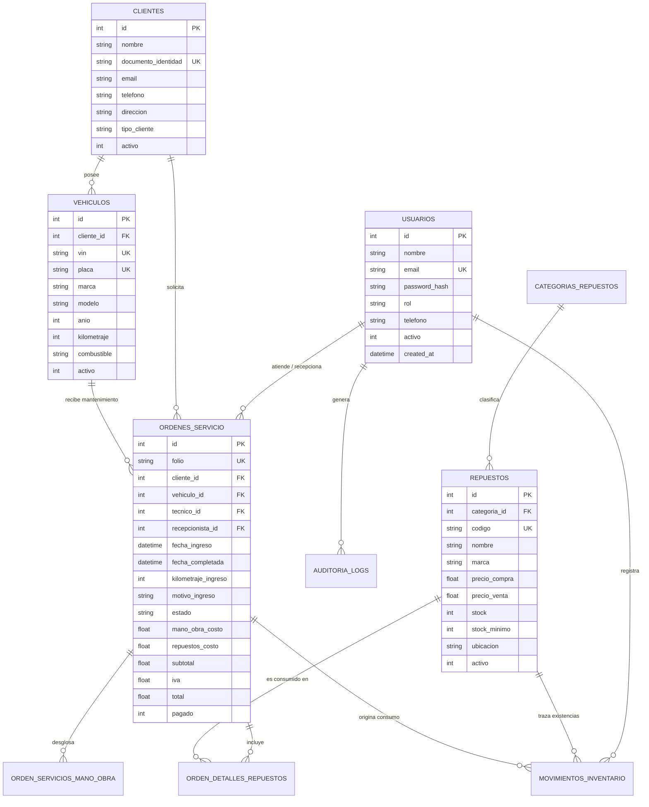

# Diccionario de Datos y Modelo Entidad-Relación - AutoGestión Pro

## 1. Diagrama Entidad-Relación (Mermaid)

---

## 2. Diccionario de Datos

### Tabla: `usuarios`
| Campo | Tipo | Nulo | Descripción / Regla |
|---|---|---|---|
| `id` | INTEGER | NO | Clave primaria autoincremental |
| `nombre` | TEXT | NO | Nombre completo del operador |
| `email` | TEXT | NO | Correo electrónico único para inicio de sesión |
| `password_hash` | TEXT | NO | Hash Bcrypt unidireccional |
| `rol` | TEXT | NO | 'admin', 'tecnico', 'recepcionista' |
| `activo` | INTEGER | NO | 1 = Activo, 0 = Inactivo (Baja lógica) |

### Tabla: `ordenes_servicio`
| Campo | Tipo | Nulo | Descripción / Regla |
|---|---|---|---|
| `id` | INTEGER | NO | Clave primaria |
| `folio` | TEXT | NO | Folio único autogenerado (ej. ORD-2026-0001) |
| `cliente_id` | INTEGER | NO | FK hacia `clientes` |
| `vehiculo_id` | INTEGER | NO | FK hacia `vehiculos` |
| `tecnico_id` | INTEGER | SÍ | FK hacia `usuarios` (mecánico responsable) |
| `recepcionista_id` | INTEGER | NO | FK hacia `usuarios` (quien recibe) |
| `estado` | TEXT | NO | 'pendiente', 'en_diagnostico', 'en_reparacion', 'espera_repuestos', 'finalizado', 'cancelado' |
| `subtotal` | REAL | NO | Suma de refacciones + mano de obra |
| `iva` | REAL | NO | 16% del subtotal |
| `total` | REAL | NO | Subtotal + IVA |
